<div align="center">


<h1>PCI-DSS Compliant Environment Platform</h1>

<p><strong>The Enterprise Blueprint for Secure, Auditable, and Segmented Cardholder Data Environments (CDE).</strong></p>

[]()
[]()
[]()

<br/>

> **"Compliance is not a point-in-time event; it is a continuous state of operational excellence."** 
> **PCI-DSS Compliant Environment Platform** is a comprehensive Infrastructure-as-Code (IaC) and software framework designed to isolate sensitive financial data. It enforces strict network segmentation, data tokenization, and immutable audit trails to provide a hardened foundation for payment processing.

</div>

---

## 🏛️ Executive Summary

Operating in a PCI-DSS governed space requires more than just encryption; it requires total **Cardholder Data Environment (CDE)** isolation. Organizations often fail to achieve compliance because they allow "Scope Creep"—where sensitive payment data touches untrusted systems, exponentially increasing the audit burden and risk of breach.

This platform provides the **CDE Control Plane**. It implements a complete **Compliance-as-Code Framework**, enabling Security and Platform teams to manage PCI controls as a first-class citizen. By automating the logical segmentation of workloads and orchestrating real-time tokenization at the edge, we ensure that every organizational asset—from databases to frontends—is isolated by default, audited for history, and strictly protected against unauthorized access.

---

## 📐 Architecture Storytelling: Principal Reference Models

### 1. Principal Architecture: Global PCI DSS Compliance Environment & CDE Control Plane
This diagram illustrates the end-to-end flow from secure traffic ingestion and WAF filtering to CDE isolation, tokenization, and institutional PCI auditing.

```mermaid
graph LR
    %% Subgraph Definitions
    subgraph TrafficIngress["Secure Ingress & DMZ"]
        direction TB
        WAF["PCI-Hardened WAF"]
        Proxy["Zero-Trust API Gateway"]
        MFA["Identity & MFA Provider"]
    end

    subgraph IntelligenceEngine["CDE Intelligence Hub"]
        direction TB
        API["FastAPI Compliance Gateway"]
        Orchestrator["CDE Provisioning Engine"]
        Governance["Policy-as-Code (OPA) Hub"]
        TokenManager["Token Lifecycle Manager"]
    end

    subgraph SegmentedCDE["Hardened CDE Zone"]
        direction TB
        TokenSvc["Tokenization Engine"]
        Vault["KMS & Key Vault"]
        PCIDB["Segmented PCI Database"]
    end

    subgraph OperationsHub["Institutional Compliance Hub"]
        direction TB
        Scorecard["Compliance Posture Scorecard"]
        SIEM["Immutable SIEM Logging"]
        Audit["Forensic PCI Metadata Lake"]
    end

    subgraph DevOps["PCI-as-Code Orchestration"]
        direction TB
        TF["Terraform PCI Modules"]
        Network["mTLS & Micro-segmentation"]
        FIM["File Integrity Monitoring"]
    end

    %% Flow Arrows
    TrafficIngress -->|1. Authenticate Request| API
    API -->|2. Validate Guardrails| Governance
    Governance -->|3. Trigger Provision| Orchestrator
    Orchestrator -->|4. Manage Tokens| TokenManager
    
    TokenManager -->|5. Tokenize PAN| TokenSvc
    TokenSvc -->|6. Encrypt at Rest| Vault
    Vault -->|7. Store Metadata| PCIDB
    
    API -->|8. Visualize Health| Scorecard
    Scorecard -->|9. Aggregate Logs| SIEM
    Scorecard -->|10. Gather Evidence| Audit
    
    TF -->|11. Provision Core| IntelligenceEngine
    Network -->|12. Enforce Isolation| SegmentedCDE
    Audit -->|13. Attest Compliance| TrafficIngress

    %% Styling
    classDef ingress fill:#f5f5f5,stroke:#616161,stroke-width:2px;
    classDef intel fill:#e3f2fd,stroke:#0d47a1,stroke-width:2px;
    classDef cde fill:#e1f5fe,stroke:#01579b,stroke-width:2px;
    classDef ops fill:#e0f2f1,stroke:#004d40,stroke-width:2px;
    classDef devops fill:#fffde7,stroke:#f57f17,stroke-width:2px;

    class TrafficIngress ingress;
    class IntelligenceEngine intel;
    class SegmentedCDE cde;
    class OperationsHub ops;
    class DevOps devops;
```

### 2. The PCI Data Lifecycle Management Flow
The continuous path of cardholder data from initial ingestion and processing to active tokenization, storage, and forensic auditing.

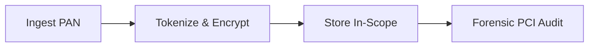

### 3. Hardened CDE Isolation & Micro-segmentation
Strategic zero-trust networking for the Cardholder Data Environment, using VPC peering, Private Links, and mTLS to prevent lateral movement.

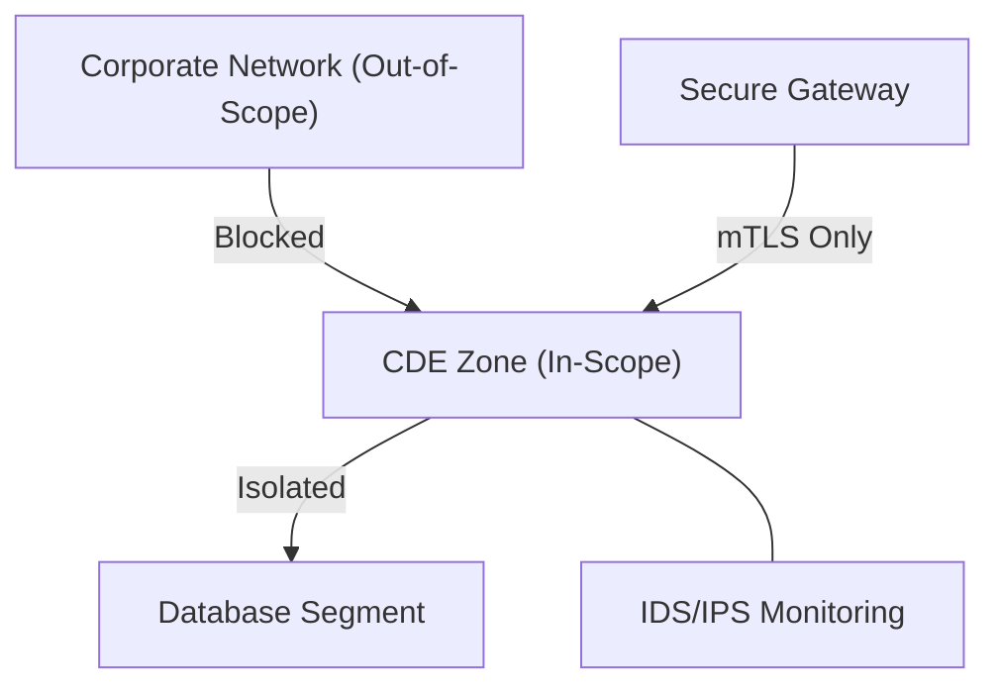

### 4. Tokenization & Encryption Mesh
End-to-end protection of Primary Account Numbers (PANs) at rest and in transit, using AES-256 encryption and persistent token vaults.

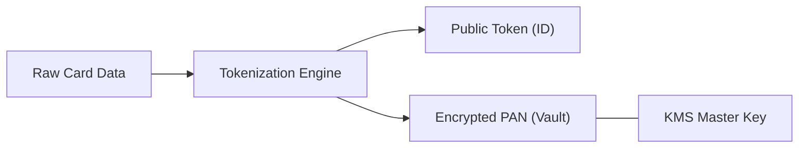

### 5. Perimeter Defense & IDS/IPS Orchestration
Multi-layered network security and threat detection that shields the CDE from external attacks and unauthorized ingress.

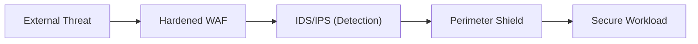

### 6. Identity & Access (IAM) for PCI Ops
Enforcing mandatory multi-factor authentication (MFA) and Just-In-Time (JIT) access for all administrative sessions within the PCI environment.

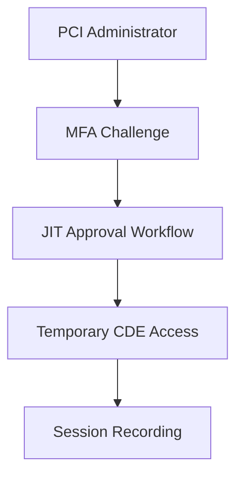

### 7. Institutional Compliance Scorecard
Grading the environment on key indicators: PCI DSS v4.0 Readiness, Segmentation Integrity, and Tokenization Density.

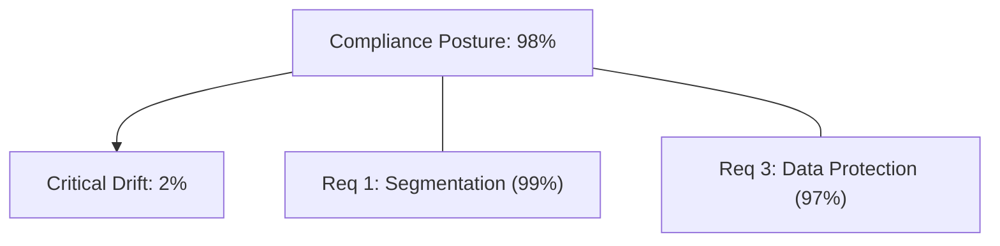

### 8. Identity & RBAC for CDE Governance
Defining fine-grained roles for auditors, PCI security engineers, and global administrators to ensure strict separation of duties.

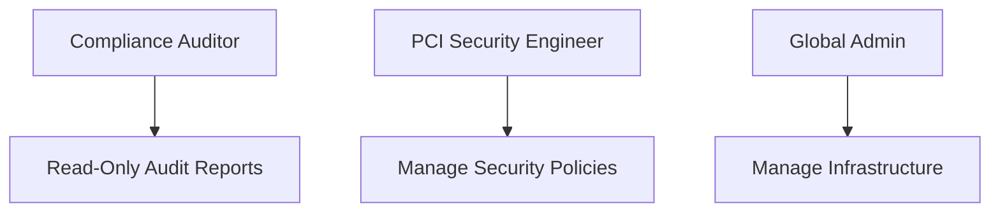

### 9. Real-time SIEM & Audit Aggregation Flow
Collecting and centralizing immutable logs from every CDE interaction to fulfill PCI Requirement 10 for forensic investigation.

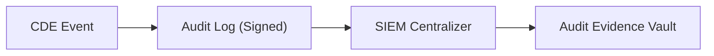

### 10. IaC Deployment: PCI-as-Code Framework
Using Terraform to deploy and manage the versioned distribution of the hardened landing zones, tokenization services, and audit sinks.

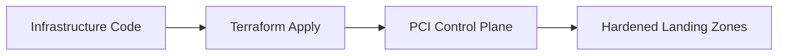

### 11. Metadata Lake for Forensic PCI Audit
Storing long-term records of every infrastructure change, access event, and tokenization action for institutional investigation and compliance.

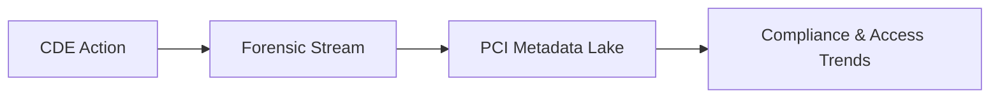

---

## 🏛️ Core PCI Pillars

1.  **Strict CDE Isolation**: Hard-fencing Cardholder Data Environments using micro-segmentation and mTLS.
2.  **Tokenization-First Strategy**: Removing downstream applications from audit scope by swapping PANs for tokens at the edge.
3.  **End-to-End Encryption**: Protecting data at rest and in transit using institutional-grade KMS and TLS 1.3.
4.  **Immutable Audit Trails**: Recording every interaction within the CDE to signed, tamper-proof audit logs.
5.  **Multi-Factor Governance**: Enforcing MFA and JIT access for all administrative and high-risk data actions.
6.  **Full Compliance-as-Code**: Mapping every PCI requirement to a versioned, testable infrastructure policy.

---

## 🛠️ Technical Stack & Implementation

### Compliance Engine & APIs
*   **Framework**: Python 3.11+ / FastAPI.
*   **Security Core**: PyCryptodome (AES-256-GCM) with hardware-backed KMS integration.
*   **Tokenization Engine**: High-throughput service for persistent token generation and detokenization.
*   **Governance Engine**: Policy-as-Code (OPA) for enforcing PCI DSS v4.0 controls in real-time.
*   **State Management**: PostgreSQL (Metadata Lake) and Redis (Token Cache).

### Compliance Dashboard (UI)
*   **Framework**: React 18 / Vite.
*   **Theme**: Dark, Blue, Emerald (High-trust, Financial aesthetic).
*   **Visualization**: Recharts for compliance scoring, token density, and segmentation health metrics.

### Infrastructure & DevOps
*   **Runtime**: AWS EKS or Azure Kubernetes Service (AKS).
*   **Networking**: VPC Endpoints, Private Links, and strictly enforced NetworkPolicies.
*   **IaC**: Modular Terraform for deploying the hardened hub and CDE zone distributions.

---

## 🏗️ IaC Mapping (Module Structure)

| Module | Purpose | Real Services |
| :--- | :--- | :--- |
| **`infrastructure/pci_hub`** | Central management plane | EKS, PostgreSQL, Redis |
| **`infrastructure/cde_zone`** | Hardened CDE workloads | Private EKS Nodes, VPC Links |
| **`infrastructure/token_svc`** | Tokenization & Encryption | KMS, Token Vault |
| **`infrastructure/auditing`** | Forensic PCI sinks | S3, Athena, Quicksight |

---

## 🚀 Deployment Guide

### Local Principal Environment
```bash
# Clone the PCI platform
git clone https://github.com/devopstrio/pci-dss-environment.git
cd pci-dss-environment

# Configure environment
cp .env.example .env

# Launch the PCI-compliant stack
make up

# Simulate a tokenization request and view audit trail simulation
make simulate-tokenize
```

Access the Compliance Dashboard at `http://localhost:3000`.

---

## 📜 License
Distributed under the MIT License. See `LICENSE` for more information.

---
<div align="center">
  <p>© 2026 Devopstrio. All rights reserved.</p>
</div>
