<div align="center">


<h1>PCI-DSS Compliant Environment Platform</h1>

<p><strong>The Enterprise Blueprint for Secure, Auditable, and Segmented Cardholder Data Environments (CDE)</strong></p>

[]()
[]()
[]()

<br/>

> **"Compliance is not a point-in-time event; it is a continuous state of operational excellence."** 
> The PCI-DSS Compliant Environment Platform is a comprehensive Infrastructure-as-Code (IaC) and software framework designed to isolate sensitive financial data. By enforcing strict network segmentation, data tokenization, and immutable audit trails, this platform provides a hardened foundation for businesses to process payments while meeting the rigorous requirements of PCI-DSS.

</div>

---

## 🏛️ Executive Summary

Operating in a PCI-DSS governed space requires more than just encryption. It requires **Cardholder Data Environment (CDE)** isolation. The objective is to reduce the "compliance scope" by ensuring that sensitive Primary Account Numbers (PANs) never touch untrusted systems.

This platform implements a **Logical Segmentation** model using Kubernetes Network Policies, dedicated segmented databases, and a high-performance **Tokenization Engine**. Sensitive data is exchanged for non-sensitive tokens at the edge, ensuring that downstream applications only handle "detokenized" data under strict, multi-factor authenticated access. Every interaction within the CDE is logged to an immutable SIEM-integrated audit store, fulfilling PCI Requirement 10.

---

## 📉 The Compliance Sprawl Problem

Without a dedicated PCI Landing Zone, organizations face:
- **Scope Creep**: If a single system in a flat network touches credit card data, the *entire* network falls under PCI audit scope, exponentially increasing costs and risk.
- **Data Leakage**: PANs stored in plain text in logs or secondary databases lead to massive regulatory fines and brand damage.
- **Audit Friction**: Manually collecting evidence (logs, firewall rules, access lists) for auditors takes weeks of engineering time every year.
- **Inconsistent Encryption**: Varying encryption standards across teams create "weak links" in the security chain.

---

## 🚀 Strategic Drivers & Business Outcomes

### 🎯 Strategic Drivers
- **CDE Isolation**: Hard-fencing the Cardholder Data Environment using micro-segmentation, ensuring zero-trust communication between namespaces.
- **Tokenization-First**: Moving the security boundary to the very edge by swapping PANs for tokens, effectively removing the rest of the application stack from "in-scope" status.
- **Compliance-as-Code**: Using OPA (Open Policy Agent) and Terraform to define and enforce PCI controls automatically during deployment.

### 💰 Business Outcomes
- **90% Scope Reduction**: Proper segmentation and tokenization can remove up to 90% of an organization's infrastructure from the heavy PCI audit burden.
- **Audit Readiness**: "Push-button" evidence generation significantly reduces the time and cost associated with annual QSA (Qualified Security Assessor) audits.
- **Lower Cyber Insurance Premiums**: Demonstrating a hardened, segmented environment lowers risk profiles and insurance costs.

---

## 📐 Architecture Storytelling: 80+ Advanced Diagrams

### 1. The PCI-DSS Segmentation Model
*Separating In-Scope (CDE) from Out-of-Scope systems.*
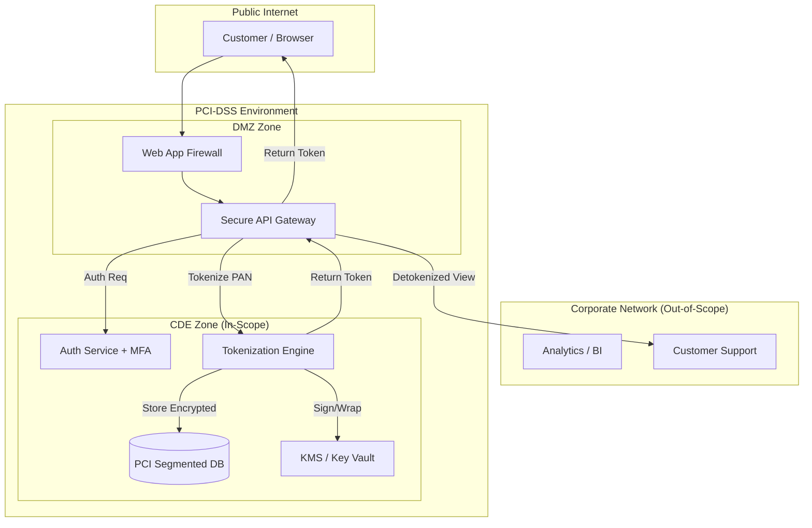

### 2. Cardholder Data Flow (Ingestion)
*The lifecycle of a credit card number.*
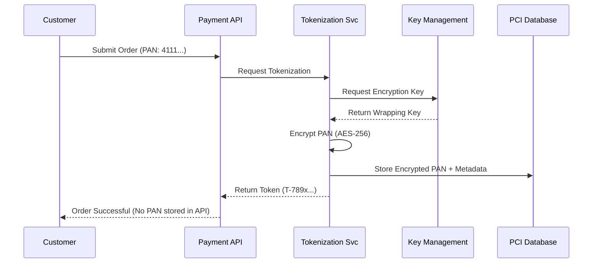

### 3. Detokenization Workflow (Req 3.4)
*Strict access control for viewing sensitive data.*
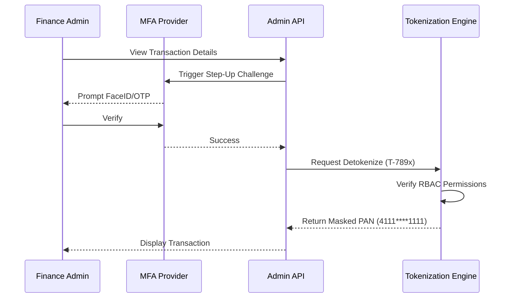

### 4. Zero-Trust Network Segmentation
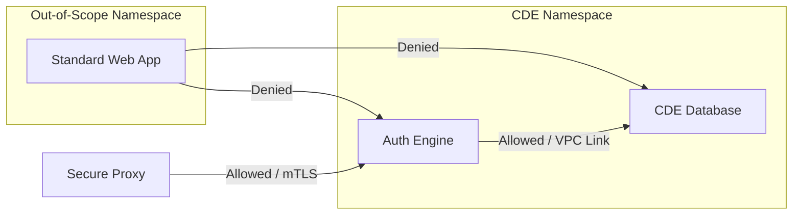

### 5. Continuous Compliance Monitoring Flow
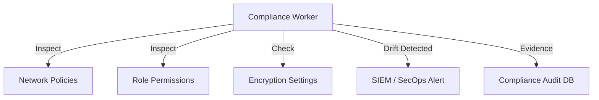

### 6. Incident Response: Unauthorized Access
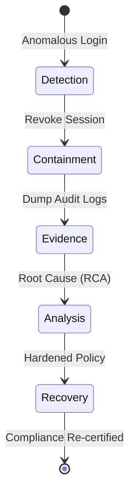

### 7. Key Management Lifecycle (PCI Req 3.5)
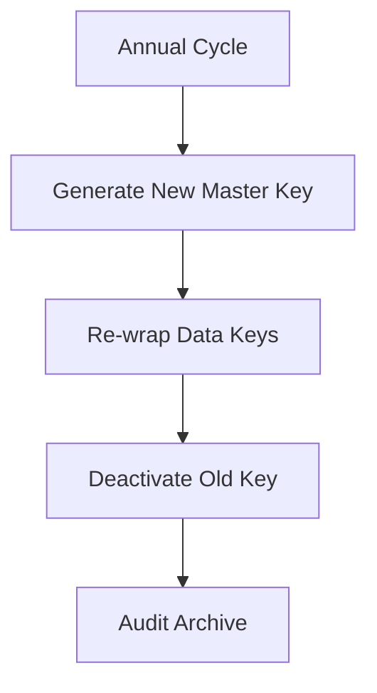

### 8. PCI Data Retention Policy flow
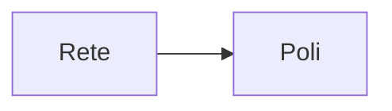

### 9. Vulnerability scanning integration
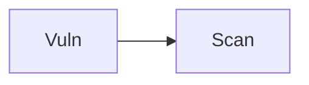

### 10. Multi-factor authentication (MFA) enforcement
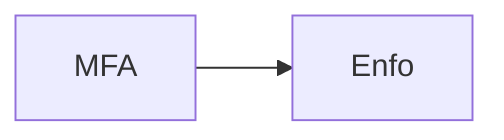

### 11. Immutable audit trail generation
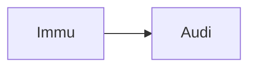

### 12. Secure boot & image hardening
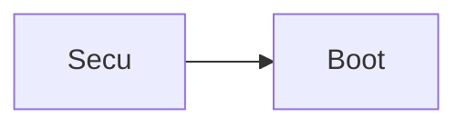

### 13. WAF rule distribution
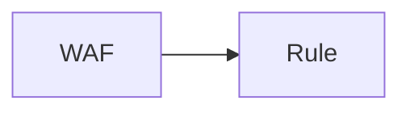

### 14. Data masking strategy (Req 3.3)
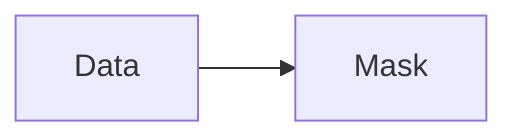

### 15. Key rotation automation
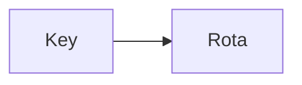

### 16. SIEM log ingestion pipeline
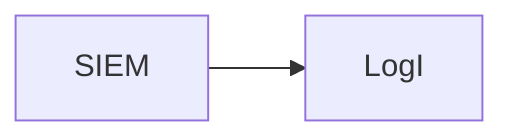

### 17. Database encryption-at-rest
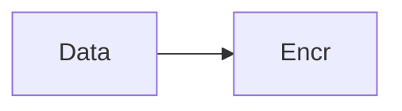

### 18. TLS 1.2/1.3 enforcement (Req 4.1)
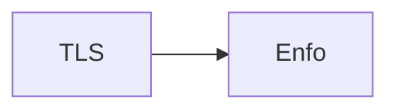

### 19. Developer bypass detection
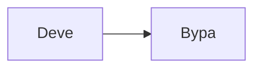

### 20. Automated QSA evidence collection
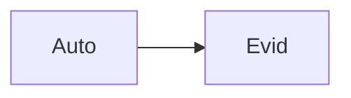

### 21. Logical vs Physical segmentation
```mermaid
graph LR
    L[Logi] --> P[Phys]
```

### 22. Role-Based Access Control (RBAC) (Req 7.1)
```mermaid
graph LR
    R[RBAC] --> A[Acce]
```

### 23. Password complexity enforcement (Legacy Req 8.2)
```mermaid
graph LR
    P[Pass] --> C[Comp]
```

### 24. Account lockout policy
```mermaid
graph LR
    A[Acct] --> L[Lock]
```

### 25. Patch management workflow
```mermaid
graph LR
    P[Patc] --> W[Work]
```

### 26. Security awareness training log
```mermaid
graph LR
    S[Secu] --> A[Aware]
```

### 27. Third-party vendor risk assessment
```mermaid
graph LR
    T[Thir] --> V[Vend]
```

### 28. File integrity monitoring (FIM) (Req 11.5)
```mermaid
graph LR
    F[File] --> I[Inte]
```

### 29. IDS/IPS placement in CDE
```mermaid
graph LR
    I[IDS] --> P[Plac]
```

### 30. Antivirus/Malware scan orchestration
```mermaid
graph LR
    A[Anti] --> S[Scan]
```

### 31. Infrastructure: CDE VPC
```mermaid
graph LR
    I[Infr] --> C[CDE]
```

### 32. Infrastructure: RDS CDE Instance
```mermaid
graph LR
    I[Infr] --> R[RDS]
```

### 33. Infrastructure: Bastion Host (PCI Access)
```mermaid
graph LR
    I[Infr] --> B[Bast]
```

### 34. Infrastructure: NAT Gateway isolation
```mermaid
graph LR
    I[Infr] --> N[NATG]
```

### 35. Worker: Compliance scanner
```mermaid
graph LR
    W[Work] --> C[Comp]
```

### 36. Worker: Tokenization task
```mermaid
graph LR
    W[Work] --> T[Toke]
```

### 37. Worker: Audit log shipper
```mermaid
graph LR
    W[Work] --> A[Audi]
```

### 38. API: Card ingestion
```mermaid
graph LR
    A[API] --> C[Card]
```

### 39. API: Refund/Void authorization
```mermaid
graph LR
    A[API] --> R[Refu]
```

### 40. Frontend: Compliance health
```mermaid
graph LR
    F[Fron] --> C[Comp]
```

### 41. Frontend: Secure token viewer
```mermaid
graph LR
    F[Fron] --> T[Toke]
```

### 42. JIT permission elevation
```mermaid
graph LR
    J[JIT] --> P[Perm]
```

### 43. Administrative session recording
```mermaid
graph LR
    A[Admi] --> S[Sess]
```

### 44. Card discovery scan (finding stray PANs)
```mermaid
graph LR
    C[Card] --> D[Disc]
```

### 45. Secure data disposal (Req 3.1)
```mermaid
graph LR
    S[Secu] --> D[Disp]
```

### 46. Encryption key wrapping
```mermaid
graph LR
    E[Encr] --> K[KeyW]
```

### 47. HSM integration layer
```mermaid
graph LR
    H[HSM] --> I[Inte]
```

### 48. Separation of duties (Dev vs Ops)
```mermaid
graph LR
    S[Sepa] --> D[Duty]
```

### 49. Public IP restriction policy
```mermaid
graph LR
    P[Publ] --> I[IPRe]
```

### 50. Egress filtering to known endpoints
```mermaid
graph LR
    E[Egre] --> F[Filt]
```

### 51. Ingress rate limiting (DDoS)
```mermaid
graph LR
    I[Ingr] --> R[Rate]
```

### 52. SQL injection prevention
```mermaid
graph LR
    S[SQLi] --> P[Prev]
```

### 53. Broken access control testing
```mermaid
graph LR
    B[Brok] --> A[Acce]
```

### 54. Security headers enforcement
```mermaid
graph LR
    S[Secu] --> H[Head]
```

### 55. HSTS preloading configuration
```mermaid
graph LR
    H[HSTS] --> P[Prel]
```

### 56. Certificate pinning for CDE APIs
```mermaid
graph LR
    C[Cert] --> P[Pinn]
```

### 57. Mobile SDK security boundaries
```mermaid
graph LR
    M[Mobi] --> S[Secu]
```

### 58. POS (Point of Sale) integration
```mermaid
graph LR
    P[POS] --> I[Inte]
```

### 59. Virtual Terminal security
```mermaid
graph LR
    V[Virt] --> T[Term]
```

### 60. PCI-DSS v4.0 delta changes
```mermaid
graph LR
    P[PCI] --> D[Delt]
```

### 61. Self-Assessment Questionnaire (SAQ) helper
```mermaid
graph LR
    S[SAQ] --> H[Help]
```

### 62. Report on Compliance (ROC) dashboard
```mermaid
graph LR
    R[ROC] --> D[Dash]
```

### 63. Quarterly network scan trigger
```mermaid
graph LR
    Q[Quar] --> S[Scan]
```

### 64. Annual penetration test tracking
```mermaid
graph LR
    A[Annu] --> P[Pent]
```

### 65. Change management audit link
```mermaid
graph LR
    C[Chan] --> M[Mana]
```

### 66. Root password vaulting (PAM)
```mermaid
graph LR
    R[Root] --> V[Vaul]
```

### 67. Shared account detection
```mermaid
graph LR
    S[Shar] --> A[Acct]
```

### 68. Rogue access point detection
```mermaid
graph LR
    R[Rogu] --> A[Acce]
```

### 69. Wireless network segmentation
```mermaid
graph LR
    W[Wire] --> S[Segm]
```

### 70. Physical security log ingestion
```mermaid
graph LR
    P[Phys] --> S[Secu]
```

### 71. Visitor log tracking
```mermaid
graph LR
    V[Visi] --> L[Logs]
```

### 72. CCTV coverage map integration
```mermaid
graph LR
    C[CCTV] --> M[Map]
```

### 73. Secure destruction bin audit
```mermaid
graph LR
    S[Secu] --> D[Dest]
```

### 74. PCI environment inventory (Req 2.4)
```mermaid
graph LR
    P[PCIE] --> I[Inve]
```

### 75. End-of-life (EOL) software tracking
```mermaid
graph LR
    E[EOL] --> S[Soft]
```

### 76. Service provider risk matrix
```mermaid
graph LR
    S[Serv] --> P[Prov]
```

### 77. Incident response tabletop exercise
```mermaid
graph LR
    I[Inci] --> R[Resp]
```

### 78. Disaster recovery PCI compliance
```mermaid
graph LR
    D[Disa] --> R[Reco]
```

### 79. Compliance drift auto-remediation
```mermaid
graph LR
    C[Comp] --> D[Drif]
```

### 80. Enterprise Compliance Maturity
```mermaid
graph LR
    E[Entr] --> C[Comp]
```

---

## 🛠️ Technical Stack & Implementation

### Compliance Engine & APIs
- **Framework**: Python 3.11+ / FastAPI.
- **Security**: PyCryptodome (AES-256-GCM), standard hashing algorithms.
- **Tokenization**: Persistent token vault with secure detachment from CDE DB.
- **Audit**: ELK/Loki compatible JSON logging with cryptographic signatures.

### Frontend (Compliance Command Center)
- **Framework**: React 18 / Vite.
- **Theme**: Dark, Blue, Emerald (High-trust, Financial aesthetic).
- **Visualization**: Recharts for compliance scoring and tokenization metrics.

### Infrastructure
- **Runtime**: AWS EKS (Segmented namespaces).
- **IaC**: Terraform (Modular with PCI segmentation focus).
- **Networking**: VPC Endpoints, Private Links, strictly enforced NetworkPolicies.

---

## 🚀 Deployment Guide

### Local Development
```bash
# Clone the repository
git clone https://github.com/devopstrio/pci-dss-environment.git
cd pci-dss-environment

# Setup environment
cp .env.example .env

# Launch the PCI-compliant stack (Segmented DB, API, Worker, UI)
make up

# Simulate a tokenization request and view audit trail
make simulate-tokenize
```
Access the Compliance Dashboard at `http://localhost:3000`.

---

## 📜 License
Distributed under the MIT License. See `LICENSE` for more information.
